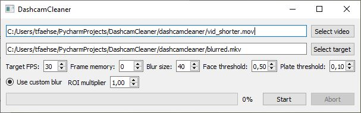

<br />
<p align="center">
  <h3 align="center">DashcamCleaner</h3>

  <p align="center">
    This tool allows you to automatically censor faces and number plates on dashcam footage.
    <br />
    <a href="https://github.com/tfaehse/DashcamCleaner/issues">Report Bug</a>
    ·
    <a href="https://github.com/tfaehse/DashcamCleaner/issues">Request Feature</a>
  </p>
</p>


<!-- TABLE OF CONTENTS -->
<details open="open">
  <summary><h2 style="display: inline-block">Table of Contents</h2></summary>
  <ol>
    <li>
      <a href="#about-the-project">About The Project</a>
    </li>
    <li>
      <a href="#getting-started">Getting Started</a>
      <ul>
        <li><a href="#prerequisites">Prerequisites</a></li>
        <li><a href="#installation">Installation</a></li>
      </ul>
    </li>
    <li><a href="#usage">Usage</a></li>
    <li><a href="#roadmap">Roadmap</a></li>
    <li><a href="#contributing">Contributing</a></li>
    <li><a href="#license">License</a></li>
    <li><a href="#contact">Contact</a></li>
    <li><a href="#acknowledgements">Acknowledgements</a></li>
  </ol>
</details>


<!-- ABOUT THE PROJECT -->
## About The Project

This project is a result of data protection laws that require identifiable information to be censored in media that is posted to the internet. Dashcam videos in particular tend to be fairly cumbersome to manually edit, so this tool aims to automate the task. Thus, it offers a simple Qt GUI in Python that apply's understand-ai's [Anonymizer](https://github.com/understand-ai/anonymizer) to each frame of an input video. 

Update: This project has undergone massive changes, the way there is described on [medium](https://medium.com/@tfaehse/making-dashcam-videos-gdpr-compliant-f9832883fe94). Anonymizer has been replaced by a custom trained YOLOv5 net that delivers much higher performance and drastically improves the amount of control over the inner workings of the system. I have written a short article on how to leverage Anonymizer to generate labeled data for training here:
The caveats of this solution, or at least the current state of this repo, all relate to the videos used to train YOLO:
- only German license plates have been used
- while FullHD, the input images are very heavily compressed
- only few input frames actually contained faces
These issues can be overcome by using the same routine for data creation and training, but with more diverse inputs - i.e. higher quality videos/images and media containing more faces. The weights in this repo will be updated as training progresses, using more epochs and more data.

<!-- GETTING STARTED -->
## Getting Started

To get a local copy up and running follow these simple steps.

### Prerequisites

You need a working Python environment with a Python version of 3.8 or higher that satisfies the listed `requirements.txt`. Depending on your machine, you can leverage GPU acceleration for pytorch - see [here](https://pytorch.org/get-started/locally/) or just use `requirements-gpu.txt`.

Further, h264 was chosen for the output video file. You can download an open source library to add support [here](https://github.com/cisco/openh264/releases).

### Installation

1. Clone the repo
   ```sh
   git clone https://github.com/tfaehse/DashcamCleaner.git
   ```
2. Set up Python environment and install requisites
   ```sh
   conda create -n py38 python=3.8
   conda activate py36
   pip install -r requirements.txt
   ```

<!-- USAGE EXAMPLES -->
## Usage
On first launch, the YOLOv5 model is automatically downloaded and fused with the custom weights for face and plate detection from this repo.



The UI is fairly self-explanatory: To use the tool, you need to:
- choose an input video file
- choose an output location
- hit start!

The options adjust parameters of the detection algorithm and post processing options laid out in [the roadmap](Roadmap). The detection threshold and inference size are direct parameters of the YOLOv5 detector, they provide the main controls for detection quality and speed that can be tweaked. In short:
- Each recognized object, i.e. a face or a license plate, possesses a confidence value that describes how likely it is to actually be a license plate. Increasing the threshold results in fewer false positives, at the cost of potential false negatives
- The performance of the detector depends on the input size of the image, so the resolution of the video. The inference scale option allows downscaling the input for detections only. The result is faster detection with reduced precision. _NOTE:_ The output video still uses the full resolution from the input video, there is no loss in quality! Only detection runs at a lower resolution.
 
The blur size determines how strongly detected faces and license plates are blurred. Boxes around faces and license plates can be enlarged by a factor between 0.8 and 10 using the ROI enlargement dial.

Sometimes, a license plate might be missed for just one frame. This one frame, usually 1/30th of a second long, still means the license plate or face could easily be identified - a computationally very cheap (as opposed to increasing the inference scale) way to fix such false negatives can be the frame memory option. In essence, it blurs not only the detected boxes in the current frame, it also blurs regions that were detected in __n__ frames before. Especially in combination with ROI enlargement and videos without very quick movement, this method can hide away missed detections.

For reference: even at 1080p inference, i.e. an inference scale of 1, a 1080p30fps video from my 70mai 1S is now blurred at around 10 frames per second, a 1 minute clip takes ~3 minutes to blur on a 5820K/GTX1060. A 10x improvement over the previous solution, with better results!


<!-- ROADMAP -->
## Roadmap

With the transition to a customized YOLOv5 detector, the original targets for the tool have been met. Performance is satisfactory and detection quality is very promising. However, work remains:

- retrain the model with better data, e.g. more faces and more high quality media
- include 
- release standalone executable

As of now, each frame is treated individually. Issues arise when a plate or a face is missed by Anonymizer in a single frame, as it will be clearly visible in the video and require manual correction. Possible ideas to combat this behavior include:
- a "frame memory": plate and face positions from the last n frames are also blurred → implemented, useful for static plates/faces
- proper plate/face tracking across frames
- enlarging of blurred regions → implemented, useful in combination with frame memory - most single missed frames can be captured this way, unless very quick movement is happening
- "light" frame tracking, i.e. first getting all ROI positions for the whole video using Anonymizer (still on a per-frame basis) and using static analysis to establish links between ROIs across frames with the goal of approximating the position of missed frames


<!-- CONTRIBUTING -->
## Contributing

Contributions are what make the open source community such an amazing place to be learn, inspire, and create. Any contributions you make are **greatly appreciated**.

1. Fork the Project
2. Create your Feature Branch (`git checkout -b feature/AmazingFeature`)
3. Commit your Changes (`git commit -m 'Add some AmazingFeature'`)
4. Push to the Branch (`git push origin feature/AmazingFeature`)
5. Open a Pull Request


<!-- LICENSE -->
## License

Distributed under the MIT License. See `LICENSE.txt` for more information.


<!-- CONTACT -->
## Contact

Thomas Fähse - tfaehse@me.com

Project Link: [https://github.com/tfaehse/DashcamCleaner](https://github.com/tfaehse/DashcamCleaner)


<!-- ACKNOWLEDGEMENTS -->
## Acknowledgements

* YOLOv5 was chosen for its combination of performance, speed and ease of use
* The original prototype was essentially a wrapper for Anonymizer, and the current implementation wouldn't have been possible without its high quality labels.