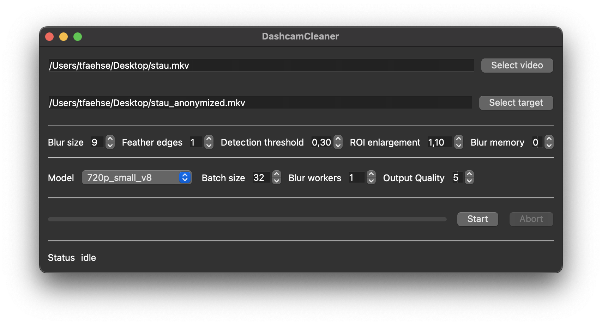

<br />
<p align="center">
  <h3 align="center">DashcamCleaner</h3>

  <p align="center">
    This tool allows you to automatically censor faces and number plates on dashcam footage.
    <br />
    <a href="https://github.com/tfaehse/DashcamCleaner/issues">Report Bug</a>
    ·
    <a href="https://github.com/tfaehse/DashcamCleaner/issues">Request Feature</a>
  </p>
</p>


<!-- TABLE OF CONTENTS -->
<details open="open">
  <summary><h2 style="display: inline-block">Table of Contents</h2></summary>
  <ol>
    <li>
      <a href="#about-the-project">About The Project</a>
    </li>
    <li>
      <a href="#getting-started">Getting Started</a>
      <ul>
        <li><a href="#prerequisites">Prerequisites</a></li>
        <li><a href="#installation-example-on-windows-using-conda">Installation example on Windows using Conda</a></li>
      </ul>
    </li>
    <li>
      <a href="#usage">Usage</a>
      <ul>
        <li><a href="#desktop">Desktop</a></li>
        <li><a href="#cli">CLI</a></li>
        <li><a href="#container">Container</a></li>
      </ul>
    </li>
    <li><a href="#weights">Weights</a></li>
    <li><a href="#roadmap">Roadmap</a></li>
    <li><a href="#contributing">Contributing</a></li>
    <li><a href="#license">License</a></li>
    <li><a href="#contact">Contact</a></li>
    <li><a href="#acknowledgements">Acknowledgements</a></li>
  </ol>
</details>


<!-- ABOUT THE PROJECT -->
## About The Project

This project is a result of data protection laws that require identifiable information to be censored in media that is posted to the internet. Dashcam videos in particular tend to be fairly cumbersome to manually edit, so this tool aims to automate the task.

The goal is to release a simple to use application with simple settings and acceptable performance that does not require any knowledge about image processing, neural networks or even programming as a whole on the end user's part.

Development started with an MVP using understand.ai's [Anonymizer](https://github.com/understand-ai/anonymizer) for its backend. Since then, the project has moved on to a custom-trained [YOLOv8](https://github.com/ultralytics/ultralytics) network. I wrote about my experiences training the network and generating training data on [Towards Data Science](https://towardsdatascience.com/making-dashcam-videos-gdpr-compliant-f9832883fe94).

<!-- GETTING STARTED -->
## Getting Started

To get a local copy up and running follow these simple steps.

### Prerequisites

You need a working Python environment with a Python version of 3.8 or higher that satisfies the listed `requirements.txt`. Depending on your machine, you can leverage GPU acceleration for pytorch - see [here](https://pytorch.org/get-started/locally/).

Since OpenCV does not care about audio channels, ffmpeg is used to combine the edited video and the audio channel of the input video. The environment variable `FFMPEG_BINARY` needs to be set to the ffmpeg executable for this to work.

### Installation example on Windows using Conda

1. Clone the repo
   ```sh
   git clone https://github.com/tfaehse/DashcamCleaner.git
   ```
2. Set up Python environment and install requisites
   ```sh
   conda create -n dcc python=3.11
   conda activate dcc
   pip install -r requirements.txt
   ```
3. Install ffmpeg binaries (release essentials is enough) and create an environment variable "FFMPEG_BINARY" that points to the ffmpeg.exe binary.
<!-- USAGE EXAMPLES -->
## Usage
On first launch, the YOLOv8 model is automatically downloaded and fused with the custom weights for face and plate detection from this repo.



The UI is fairly self-explanatory: To use the tool, you need to:
- choose an input video file
- choose an output location
- hit start!

The options adjust parameters of the detection algorithm and post-processing options laid out in [the roadmap](Roadmap). The detection threshold and inference size are direct parameters of the YOLOv8 detector, they provide the main controls for detection quality and speed that can be tweaked. In short:
- Each recognized object, i.e. a face or a license plate, possesses a confidence value that describes how likely it is to actually be a license plate or a face. Increasing the threshold results in fewer false positives, at the cost of potential false negatives
- The performance of the detector depends on the input size of the image, so the resolution of the video. The inference size option allows downscaling the input for detections only. The result is faster detection with reduced precision. _NOTE:_ The output video still uses the full resolution from the input video, there is no loss in quality! Only detection runs at a lower resolution.

The blur size determines how strongly detected faces and license plates are blurred. Boxes around faces and license plates can be enlarged by a factor between 0.8 and 10 using the ROI enlargement dial.

Sometimes, a license plate might be missed for just one frame. This one frame, usually 1/30th of a second long, still means the license plate or face could easily be identified - a computationally very cheap (as opposed to increasing the inference scale) way to fix such false negatives can be the frame memory option. In essence, it blurs not only the detected boxes in the current frame, it also blurs regions that were detected in __n__ frames before. Especially in combination with ROI enlargement and videos without very quick movement, this method can hide away missed detections.

For reference: even at 1080p inference, i.e. an inference scale of 1, a 1080p30fps video from my 70mai 1S processes at around 10 frames per second, a 1 minute clip takes ~3 minutes to blur on a 5820K/GTX1060 machine.

# CLI

There's now also a fairly simple CLI to blur a video:

```
usage: cli.py -i INPUT_PATH -o OUTPUT_PATH [-w WEIGHTS] [-bw BLUR_WORKERS] [-s [1, 1024]] [-b [1, 99]] [-t [0.0, 1.0]] [-r [0.0, 2.0]] [-q [1.0, 10.0]] [-fe [0, 99]] [-nf] [-m] [-mc] [-td [0.01, 0.99]]
              [-tm [0, 10]] [-j] [-h]

This tool allows you to automatically censor faces and number plates on dashcam footage.

required arguments:
    -i INPUT_PATH
    --input-path INPUT_PATH
        Input video file path. Pass a folder name for batch processing all files in the folder.
        
    -o OUTPUT_PATH
    --output-path OUTPUT_PATH
        Output video file path. Pass a folder name for batch processing.
        

optional arguments:
    -w WEIGHTS  (Default: 720p_medium_mosaic)
    --weights WEIGHTS
        Weights file to use. See readme for the differences. (default = 720p_medium_mosaic).
        
    -bw BLUR_WORKERS  (Default: 2)
    --blur-workers BLUR_WORKERS
        Amount of processes to use for blurring frames. (default = 2)
        
    -b [1, 99]  (Default: 9)
    --blur-size [1, 99]
        Kernel radius of the blurring-filter. Higher value means more blurring, 0 would mean no blurring at all.
        
    -t [0.0, 1.0]  (Default: 0.4)
    --threshold [0.0, 1.0]
        Detection threshold. Higher value means more certainty, lower value means more blurring. This setting affects runtime, a lower threshold means slower execution times.
        
    -r [0.0, 2.0]  (Default: 1.0)
    --roi-multi [0.0, 2.0]
        Increase or decrease the area that will be blurred - 1.0 means no change.
        
    -q [1.0, 10.0]  (Default: 10)
    --quality [1.0, 10.0]
        Quality of the resulting video. higher = better. Conversion to crf: ⌊(1-q/10)*51⌋.
        
    -fe [0, 99]  (Default: 5)
    --feather-edges [0, 99]
        Feather edges of blurred areas, removes sharp edges on blur-mask. 
        Expands mask by argument and blurs mask, so effective size is twice the argument.
        
    -nf   (Default: False)
    --no-faces 
        Do not censor faces.
        
    -h 
    --help 
        Show this help message and exit.
        

optional arguments (advanced):
    -s [1, 1024]  (Default: 2)
    --batch-size [1, 1024]
        Inference batch size - large values require a lof of memory and may cause crashes!
        This will read multiple frames at the same time and perform detection on all of those at once.
        Not recommended for CPU usage.
        
    -m   (Default: False)
    --export-mask 
        Export a black and white only video of the blur-mask without applying it to the input clip.
        
    -mc   (Default: False)
    --export-colored-mask 
        Export a colored mask video of the blur-mask without applying it to the input clip.
        The value represents the confidence of the detector.
        Lower values mean less confidence, brighter colors mean more confidence.
        If the --threshold setting is larger than 0 then detections with a lower confidence are discarded.
        Channels; Red: Faces, Green: Numberplates.
        Hint: turn off --feather-edges by setting -fe=0 and turn --quality to 10
        
    -td [0.01, 0.99]  (Default: 0.1)
    --tracking-dist [0.01, 0.99]
        Maximum pixel difference between subsequent frames for the tracker to associate a prediction with a 
        new detection. This is expressed in relation to the image height, e.g. 0.1 would mean 108 pixels for a FullHD video
        
    -tm [0, 10]  (Default: 3)
    --tracking-memory [0, 10]
        Max. length a valid track can be kept alive for if no new detections are processed. This value is used
        for both the forward and the backward pass of the tracking. Setting it to 0 disables the tracking.
        
    -j   (Default: False)
    --export-json 
        Export detections (based on index) to a JSON file.
```


### Container

Batch processing videos inside a docker (or podman) container

```bash
mkdir -p {input,output} # then place your video files in the input folder
docker run -it --rm -v "$PWD/input:/input" -v "$PWD/output:/output" ghcr.io/tfaehse/dashcamcleaner:edge
# to customize options, just use regular cli parameter:
docker run -it --rm -v "$PWD/input:/input" -v "$PWD/output:/output" ghcr.io/tfaehse/dashcamcleaner:edge --weights 1080p_medium_mosaic --blur_size 25 --inference_size 1080 --quality 7 --batch_size 10
```

GPU Support:
```bash
# test driver works
docker run -it --rm --gpus all nvidia/cuda:12.0.1-runtime-ubuntu22.04  nvidia-smi
docker run -it --rm --gpus all -v "$PWD/input:/input" -v "$PWD/output:/output" ghcr.io/tfaehse/dashcamcleaner:edge
# Output should contain "Using NVIDIA GeForce RTX xxxx.", not: "Using CPU."
```

Manual Docker Image Build:
```bash
git clone https://github.com/tfaehse/DashcamCleaner.git
docker build --pull -t dashcamcleaner DashcamCleaner
mkdir -p {input,output}
# place your files in the input folder
docker run -it --rm -v "$PWD/input:/input" -v "$PWD/output:/output" dashcamcleaner
# to customize options, just use regular parameter:
docker run -it --rm -v "$PWD/input:/input" -v "$PWD/output:/output" dashcamcleaner --weights 1080p_medium_v8
```

<!-- WEIGHTS -->
## Weights

DashcamCleaner now supports loading weights dynamically, differently trained networks can be selected in the user interface. As part of this change, I will distribute trained networks for German roads with different training parameters over the next weeks:
- different training image resolutions
- different network depths, i.e. YOLOv8's nano, small and medium definitions
- ~~training with (_mosaic) and without (_rect) yolov8's mosaic dataloader~~ only mosaic weights are available by now, as they perform significantly better

Once this is completed, I intend to publish an analysis on how training and inference image size and network depth affect performance and quality of the program.

As a rule of thumb:
- bigger image sizes lead to better detection of small objects, for both training and inference
- deeper networks have a higher ceiling for object detection but slow down training and inference
- lowering inference image size can dramatically speed up the program
- the mosaic dataloader has a large, positive impact. This was slightly unexpected for me, I assumed the (higher) resolution of fixed-size training would improve results, given that lots of objects are very small

In summary, you should select the highest inference image size you can afford. Inference size (if your input allows it) has a larger impact on detections than the ntwork size, i.e. in my caase 1080p_small beats 720p_medium

<!-- ROADMAP -->
## Roadmap

With the transition to a custom YOLOv8 detector, the original targets for the tool have been met. Performance is satisfactory and detection quality is very promising. However, work remains:
- further trained networks and an analysis of different network sizes and image sizes used for training
- release standalone executable

Implemented post processing steps:
- ~~a "frame memory": plate and face positions from the last n frames are also blurred → useful for static plates/faces~~ removed because frames are processed in parallel now
- enlarging of blurred regions
- tracking detections in time, forward and backward, to fill gaps from the detector


<!-- CONTRIBUTING -->
## Contributing

Contributions are what make the open source community such an amazing place to be learn, inspire, and create. Any contributions you make are **greatly appreciated**.

1. Fork the Project
2. Create your Feature Branch (`git checkout -b feature/AmazingFeature`)
3. Commit your Changes (`git commit -m 'Add some AmazingFeature'`)
4. Push to the Branch (`git push origin feature/AmazingFeature`)
5. Open a Pull Request


<!-- LICENSE -->
## License

Distributed under the MIT License. See `LICENSE.txt` for more information.


<!-- CONTACT -->
## Contact

Project Link: [https://github.com/tfaehse/DashcamCleaner](https://github.com/tfaehse/DashcamCleaner)


<!-- ACKNOWLEDGEMENTS -->
## Acknowledgements

* YOLOv8 was chosen for its combination of performance, speed and ease of use
* The original prototype was essentially a wrapper for Anonymizer, and the current implementation wouldn't have been possible without its high quality labels.
